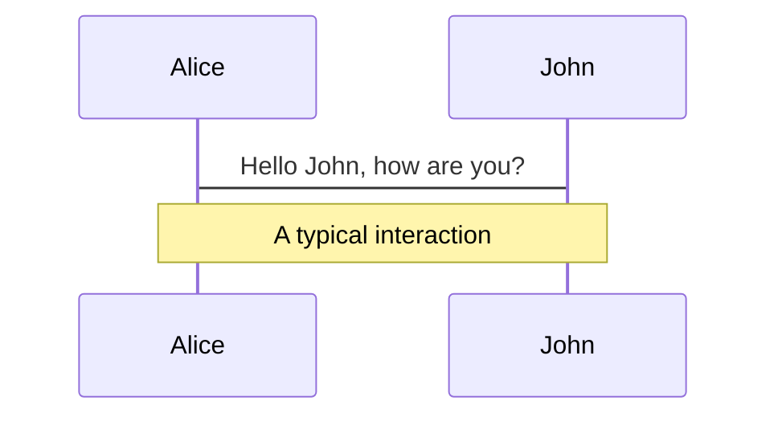
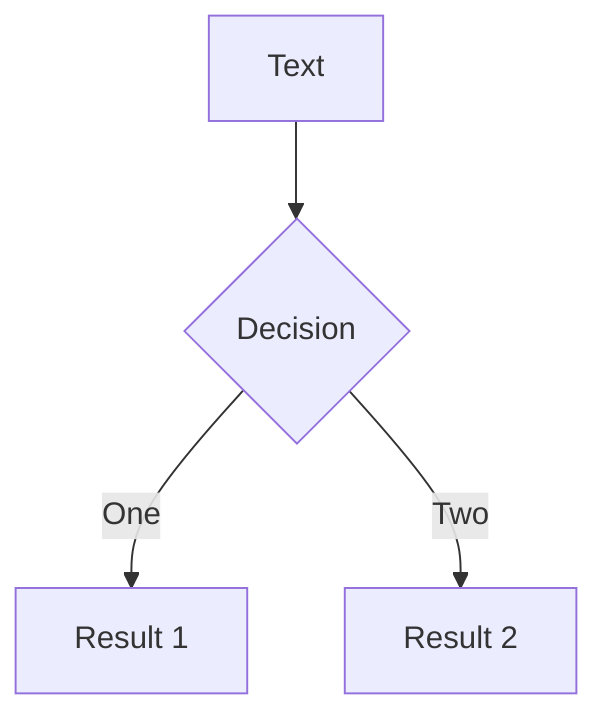

# Demo

---
layout: section
---

# Layouts

---

# Default

* Slide bullet text
* Slide bullet text
* Slide bullet text

---
layout: bullets
---

* Slide bullet text
* Slide bullet text
* Slide bullet text

---
layout: intro
---

# Intro Layout

Presentation subtitle

<div class="absolute bottom-10">
  <span class="font-700">
    Author and Date
  </span>
</div>

---
layout: intro-image
image: 'https://live.staticflickr.com/65535/49768700213_0c23e49354_z.jpg'
---

<div class="absolute top-10">
  <span class="font-700">
    Author and Date
  </span>
</div>

<div class="absolute bottom-10">
  <h1>Intro-Image Layout</h1>
  <p>Presentation subtitle</p>
</div>

---
layout: intro-image-right
image: 'https://live.staticflickr.com/65535/49768700213_0c23e49354_z.jpg'
---

# Intro-Image-Right Layout

## Slide Subtitle

---

---
layout: two-cols
---

# Left

* Slide bullet text
* Slide bullet text
* Slide bullet text

::right::

# Right

* Slide bullet text
* Slide bullet text
* Slide bullet text

---
layout: image-right
image: 'https://live.staticflickr.com/65535/49768700213_0c23e49354_z.jpg'
---

# Image-Right Layout

## Slide Subtitle

* Slide bullet text
* Slide bullet text
* Slide bullet text

---
layout: section
---

# Section Layout

---
layout: statement
---

# Statement Layout

---
layout: fact
---

# Fact Layout
Fact information

---
layout: quote
---

# "Quote Layout"
Attribution

---
layout: 3-images
imageLeft: 'https://live.staticflickr.com/65535/49768700213_0c23e49354_z.jpg'
imageTopRight: 'https://live.staticflickr.com/65535/49768700213_0c23e49354_z.jpg'
imageBottomRight: 'https://live.staticflickr.com/65535/49768700213_0c23e49354_z.jpg'
---

---
layout: image
image: 'https://live.staticflickr.com/65535/49768700213_0c23e49354_z.jpg'
---

---
layout: section
---

# Code Highlighter

---
highlighter: shiki
---

# Code Example

```elixir {5|9-13|all}
defmodule Weather.ApiTest do
  @moduledoc false

  use ExUnit.Case
  use ExVCR.Mock, adapter: ExVCR.Adapter.Hackney

  describe "get_forecast/1" do
    test "success: get weather for (correct) city" do
      use_cassette "api_successful_request" do
        {:ok, forecast} = "Lisbon" |> Weather.Api.get_forecast()
        assert forecast["city"]["name"] == "Lisbon"
        assert forecast["city"]["country"] == "PT"
      end
    end
  end
end

```

---
layout: section
---

# Markdown Syntax

---

# Local image

![working][]

* Slide bullet text
* Slide bullet text
* Slide bullet text
 
![working][]

[working]: /images/working.jpg

---

# Local image tag


* Slide bullet text
* Slide bullet text
* Slide bullet text
 


---

# Local image tag (II)


* Slide bullet text
* Slide bullet text
* Slide bullet text

---

# Presenter Notes

* Slide bullet text
* Slide bullet text
* Slide bullet text

<!--
This is a paragraph.

And this is a bullet list ...

* ???
* ???
* ???
-->

---

# Icons

<mdi-account-circle /> - ??? <br/>
<carbon-badge /> - ??? <br/>
<uim-rocket /> - ??? <br/>
<twemoji-cat-with-tears-of-joy /> - ??? <br/>
<logos-vue /> - ??? <br/>

View more/all [icons][] ... like ...

<mi-circle-add />
<mi-circle-remove />
<mi-circle-check />
<mi-circle-error />
<mi-circle-help />
<mi-circle-information />

[icons]: https://icones.js.org

---

# Diagrams



---

# Diagrams (cont.)


